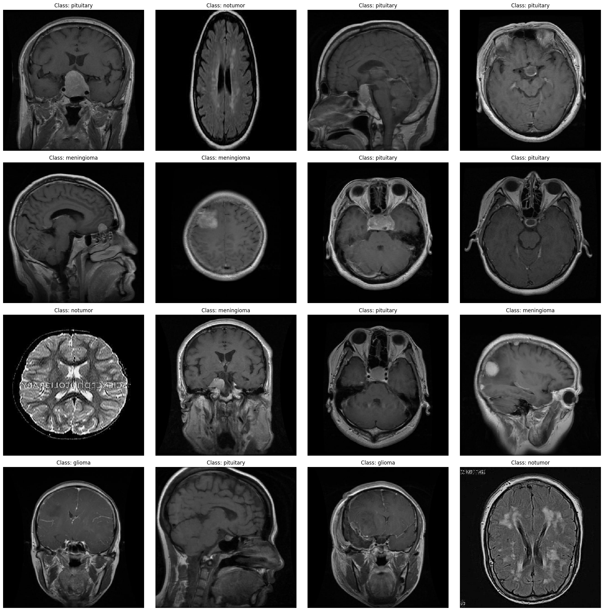
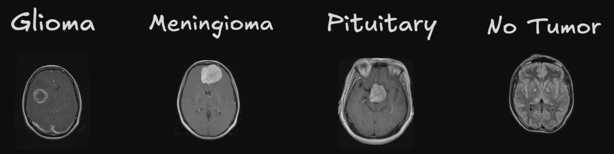
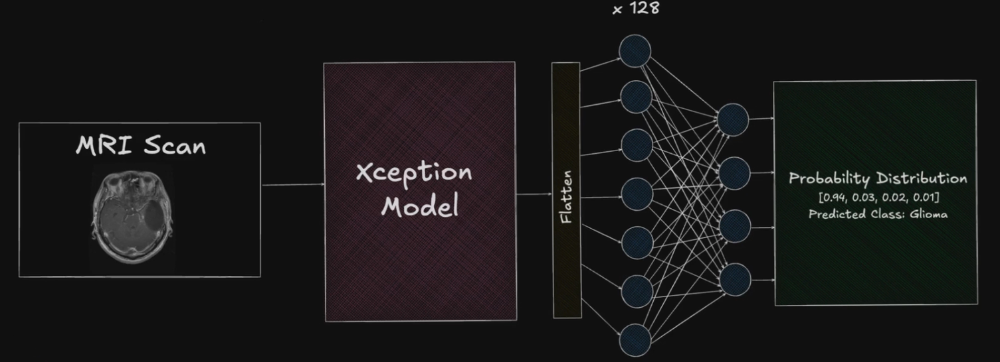
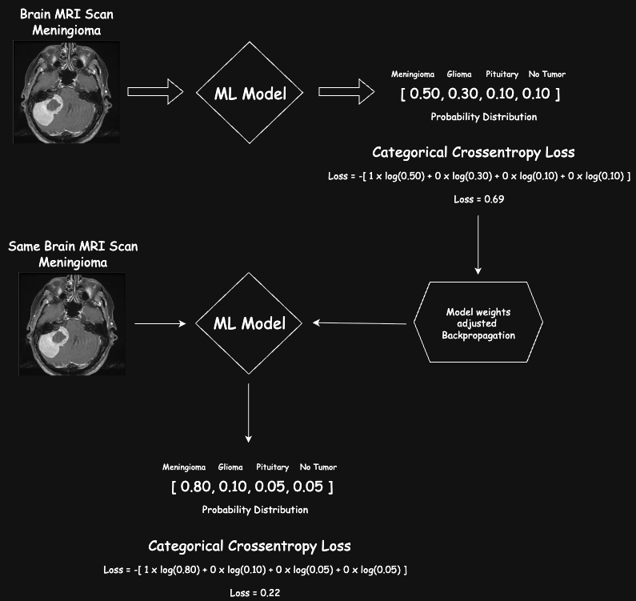
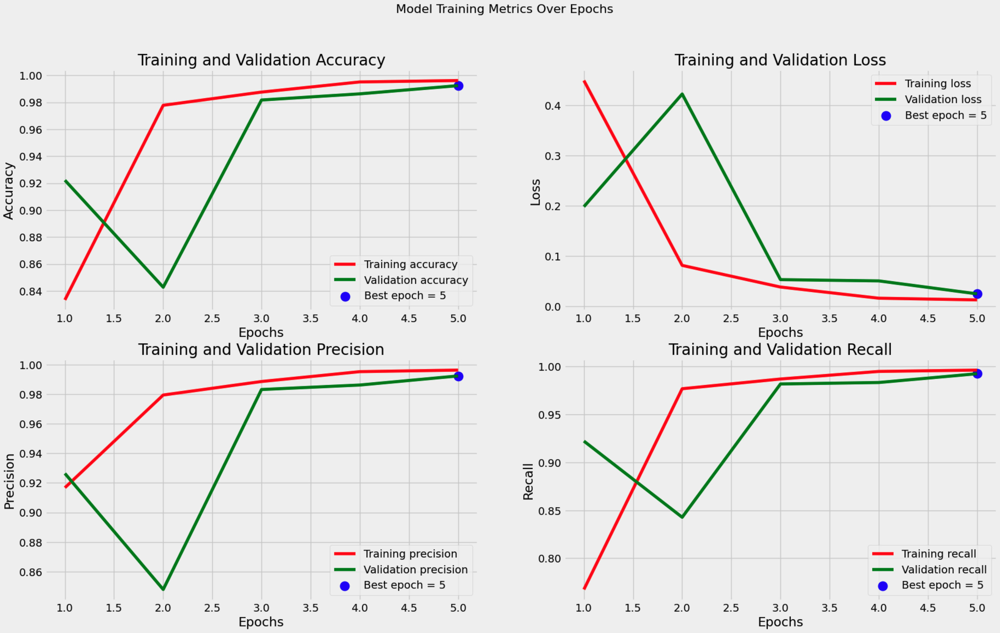
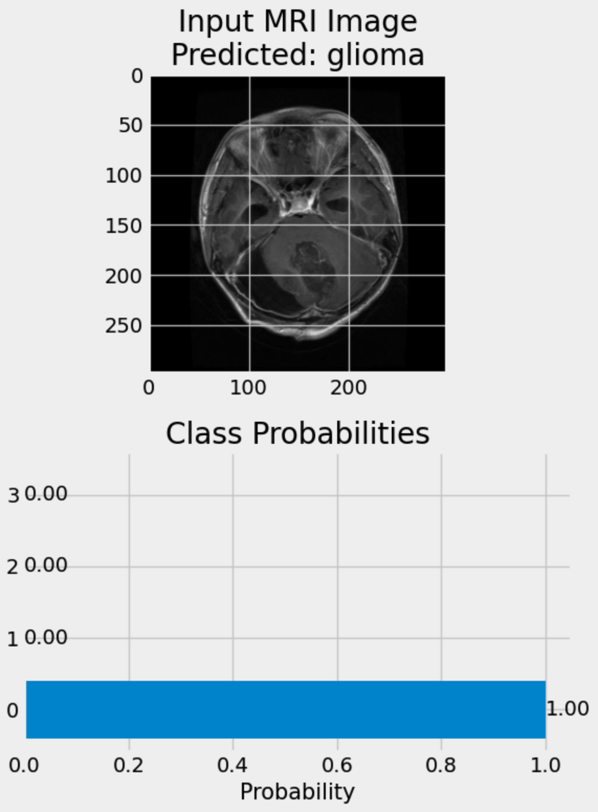
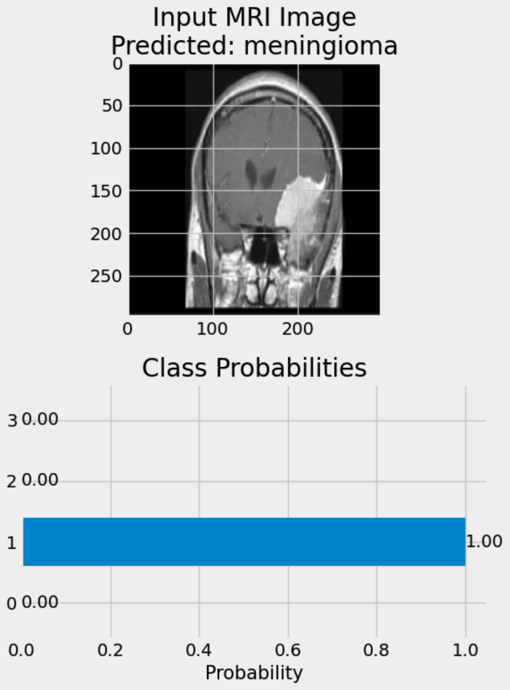

# 🧠 Brain Tumor Classification

**AI-Powered Brain Tumor Detection using Deep Learning**

This repository contains a brain tumor classification system that uses deep learning to analyze MRI scans and classify them into four categories. The project includes a Streamlit web application for easy interaction with the trained model.

## 🎯 Project Overview

Brain tumor classification is a critical medical imaging task where accuracy can significantly impact patient outcomes. This system addresses the inherent challenges in medical image analysis by providing consistent, precise tumor classification that supports healthcare professionals in their diagnostic process.

### 🧠 Why AI-Powered Brain Tumor Classification Matters

MRI scans exhibit significant variability in:

- **Shapes and sizes** - Tumors appear differently across patients
- **Orientations** - Scans taken from various angles (sagittal, coronal, axial)
- **Brightness levels** - Different imaging protocols and equipment settings
- **Image quality** - Variations in resolution and contrast



This variability makes it challenging, even for experienced neurologists and neurosurgeons, to confidently distinguish between tumor types through visual examination alone. The subtle differences and inconsistencies can lead to misclassification by humans.

**Machine learning models provide:**

- ✅ **Consistency** - Eliminates human variability in interpretation
- ✅ **Precision** - Analyzes patterns across thousands of training examples
- ✅ **Speed** - Rapid analysis supporting faster diagnosis
- ✅ **Interpretability** - Visual insights into model decision-making process

## 🔬 Tumor Classification Categories

The system classifies brain MRI scans into **4 distinct categories**:



| Tumor Type     | Description                       | Characteristics                                      |
| -------------- | --------------------------------- | ---------------------------------------------------- |
| **Glioma**     | Most common malignant brain tumor | Arises from glial cells, infiltrative growth pattern |
| **Meningioma** | Usually benign tumor              | Arises from meninges, well-defined borders           |
| **Pituitary**  | Tumor of pituitary gland          | Located in sella turcica, affects hormone production |
| **No Tumor**   | Normal brain tissue               | Healthy brain MRI without pathological findings      |

## 🏗️ Model Architecture

### Transfer Learning with Xception

The system utilizes **Google's Xception model** for transfer learning - a powerful convolutional neural network that excels at image classification tasks. Xception's depthwise separable convolutions efficiently analyze spatial and channel-wise features, making it ideal for medical imaging applications.



**Why Xception?**

- 🔥 **Efficient Feature Extraction** - Breaks down images into meaningful components
- 🎯 **High Accuracy** - Proven performance on complex image classification
- ⚡ **Optimized Processing** - Faster inference compared to traditional CNNs
- 🧠 **Transfer Learning Ready** - Pre-trained on ImageNet, fine-tuned for medical data

### Model Pipeline Flow



The prediction pipeline processes MRI images through:

1. **Image Preprocessing** - Resize to 299x299, normalization
2. **Feature Extraction** - Xception backbone extracts deep features
3. **Classification Head** - Dense layers with dropout for final prediction
4. **Probability Distribution** - Softmax output for all 4 classes
5. **Loss Calculation** - Categorical crossentropy for model optimization

## 📊 Model Performance

The trained Xception model achieves exceptional performance metrics:



### Performance Metrics

- 🏆 **Test Accuracy: 98.48%**
- 📉 **Test Loss: 0.0626**
- 🎯 **Validation Accuracy: 99.24%**
- 📊 **Validation Loss: 0.0239**
- 🔥 **Training Accuracy: 99.95%**
- 📈 **Training Loss: 0.0032**

### Sample Predictions

<div align="center">
<table>
<tr>
<td align="center">
<strong>Glioma Detection Example</strong><br>

</td>
<td align="center">
<strong>Meningioma Detection Example</strong><br>

</td>
</tr>
</table>
</div>

## 🗂️ Project Structure

```
Brain-Tumor-Classification/
├── app.py                                  # Main Streamlit application
├── requirements.txt                        # Python dependencies
├── README.md                               # Project documentation
├── models/                                 # Trained model weights
│   └── xception_model.weights.h5           # Xception model weights (253MB)
├── sample_images/                          # Sample MRI images for testing
│   ├── Te-glTr_0000.jpg                    # Glioma samples
│   ├── Te-glTr_0001.jpg
│   ├── Te-glTr_0002.jpg
│   ├── Te-meTr_0000.jpg                    # Meningioma samples  
│   ├── Te-meTr_0001.jpg
│   ├── Te-meTr_0002.jpg
│   ├── Te-noTr_0000.jpg                    # No tumor samples
│   ├── Te-noTr_0001.jpg
│   ├── Te-noTr_0002.jpg
│   ├── Te-piTr_0000.jpg                    # Pituitary samples
│   ├── Te-piTr_0001.jpg
│   └── Te-piTr_0002.jpg
├── research/                               # Research and development
│   ├── notebooks/
│   │   └── BrainTumorClassification.ipynb  # Model training notebook
│   └── documentation/
│       └── findings.txt                    # Research findings and notes
├── Testing/                                # Test dataset (4 classes)
│   ├── glioma/                             # 300 test images
│   ├── meningioma/                         # 306 test images  
│   ├── notumor/                            # 405 test images
│   └── pituitary/                          # 300 test images
├── Training/                               # Training dataset (4 classes)
│   ├── glioma/                             # Training images
│   ├── meningioma/                         # Training images
│   ├── notumor/                            # Training images
│   └── pituitary/                          # Training images
└── venv/                                   # Virtual environment (local)
```

## ✅ Current Implementation

### Completed Features
- ✅ **Xception Model Training** - Transfer learning model achieving 98.48% test accuracy
- ✅ **Streamlit Web Application** - Interactive interface for image upload and prediction
- ✅ **Data Processing Pipeline** - Complete preprocessing and data augmentation
- ✅ **Model Evaluation** - Comprehensive performance metrics and visualizations
- ✅ **Sample Images** - Pre-loaded test images for demonstration

### Model Performance
- **Training Accuracy**: 99.95%
- **Validation Accuracy**: 99.24%
- **Test Accuracy**: 98.48%
- **Architecture**: Xception (pre-trained) + custom classification layers

## 🔮 Future Enhancements

### Core Features to Implement
- 🔍 **Saliency Maps** - Visual explanations using GRAD-CAM or similar techniques
- 🤖 **Custom CNN Model** - Train custom architecture to achieve 98%+ accuracy (Challenge 1)
- 🎯 **Alternative Transfer Learning** - Different base models targeting 99% accuracy (Challenge 2)
- 🤝 **Multimodal LLM Integration** - User-selectable AI models for explanations (Challenge 3)
- 💬 **Interactive Chat** - Conversational interface with MRI scan analysis (Challenge 4)
- 📋 **Comprehensive Reports** - Medical reports with insights and recommendations (Challenge 5)
- 📊 **Model Comparison Dashboard** - Side-by-side CNN model comparison (Challenge 6)

### Technical Roadmap
- [ ] **GRAD-CAM Visualization** - Implement saliency mapping for model interpretability
- [ ] **Custom CNN Architecture** - Design and train from-scratch CNN model
- [ ] **ResNet/EfficientNet Models** - Test alternative transfer learning approaches
- [ ] **Gemini 1.5 Flash Integration** - AI-powered scan explanations
- [ ] **LLM Selection UI** - Interface for choosing explanation models
- [ ] **Chat Interface** - Multi-turn conversation about MRI analysis
- [ ] **Report Generation** - PDF/HTML medical report export
- [ ] **Model Benchmarking** - Interactive dashboard for model comparison

## 🔬 Dataset Information

- **Total Images**: 7,023 brain MRI scans
- **Classes**: 4 (Glioma, Meningioma, Pituitary, No Tumor)
- **Format**: JPG images with varying dimensions
- **Source**: [Kaggle Brain Tumor MRI Dataset](https://www.kaggle.com/datasets/masoudnickparvar/brain-tumor-mri-dataset)
- **Preprocessing**: Resize to 299x299, normalization, data augmentation

## 🌐 Deployment Architecture

This Streamlit application is designed for **easy deployment** on various platforms:

- **Streamlit Cloud**: Direct GitHub integration, free hosting for public repos
- **Heroku**: Container-based deployment with model file support
- **Railway**: Simple deployment with generous resource limits
- **Google Cloud Run**: Scalable serverless deployment
- **AWS EC2**: Full control over compute resources

## 🛠️ Installation & Setup

### Prerequisites
- Python 3.8+ recommended
- Git for cloning the repository

### Local Setup Instructions

1. **Clone the repository**
   ```bash
   git clone https://github.com/MisbahAN/Brain-Tumor-Classification.git
   cd Brain-Tumor-Classification
   ```

2. **Create a virtual environment**
   ```bash
   python -m venv venv
   
   # Activate virtual environment
   # On Windows:
   venv\Scripts\activate
   
   # On macOS/Linux:
   source venv/bin/activate
   ```

3. **Install dependencies**
   ```bash
   pip install -r requirements.txt
   ```

4. **Run the Streamlit application**
   ```bash
   streamlit run app.py
   ```

5. **Access the application**
   - Open your browser and navigate to: `http://localhost:8501`
   - The app will be running on your local machine

### Note on Model Weights
The trained model weights (`xception_model.weights.h5`) are approximately 253MB and may not be included in the repository due to size limitations. If you encounter issues loading the model, please refer to the training notebook in `research/notebooks/` to retrain the model.

## 🚀 Usage

### Web Application
1. **Launch the app**: Run `streamlit run app.py` in your terminal
2. **Select input method**:
   - **Use Sample Image**: Choose from pre-loaded MRI scans
   - **Upload Your Own**: Upload a brain MRI image (JPG, JPEG, PNG)
3. **Analyze the image**: Click "Analyze Image" to get predictions
4. **View results**: See the predicted tumor type, confidence score, and probability distribution

### Model Training
To train the model yourself:
1. Open the Jupyter notebook: `research/notebooks/BrainTumorClassification.ipynb`
2. Download the dataset using the Kaggle command provided in the notebook
3. Follow the training pipeline to reproduce the results

## 📱 App Features

- 🖼️ **Image Upload/Selection** - Support for JPG, JPEG, PNG formats
- 🤖 **AI Prediction** - Real-time tumor classification with confidence scores
- 📊 **Probability Visualization** - Interactive charts showing class probabilities
- 🎨 **Clean UI** - Modern interface with intuitive design
- ⚡ **Fast Inference** - Optimized model loading and prediction
- 📱 **Responsive Design** - Works on desktop and mobile devices

## 🧪 Model Validation

The model was trained and validated using:
- **Training Set**: 5,712 images
- **Validation Set**: 655 images  
- **Test Set**: 656 images
- **Evaluation Metrics**: Accuracy, Precision, Recall, Loss
- **Cross-validation**: Stratified split to ensure class balance

---

## 👨‍💻 Author

**Misbah Ahmed Nauman**  
Portfolio: [MisbahAN.com](https://MisbahAN.com)

---

*This project demonstrates deep learning techniques for medical image classification with a focus on brain tumor detection and analysis.*
